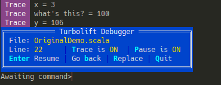

# Debug as an Effect (DaaE)

Tiny debugger, implemented with Algebraic Effects.

Inspired by [stepwise](https://share.unison-lang.org/@pchiusano/stepwise)
for [Unison](https://www.unison-lang.org/) language.
In [this announcement post on Twitter](https://twitter.com/pchiusano/status/1502760429466042368),
the author included a **3-minute video** showing the debugger in action.
I encourage everyone to watch it.

This project is a reimplementation of the idea in Scala,
using [Turbolift](https://github.com/marcinzh/turbolift) effect system.

